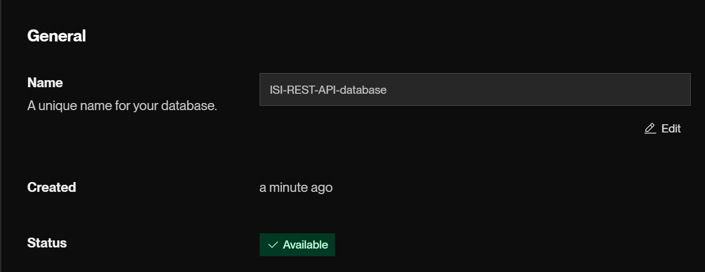
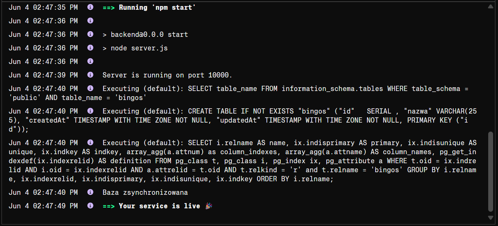
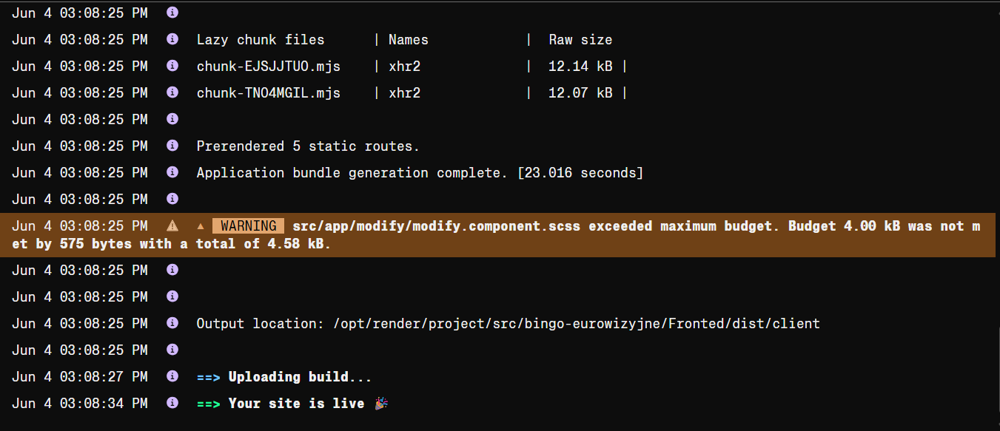
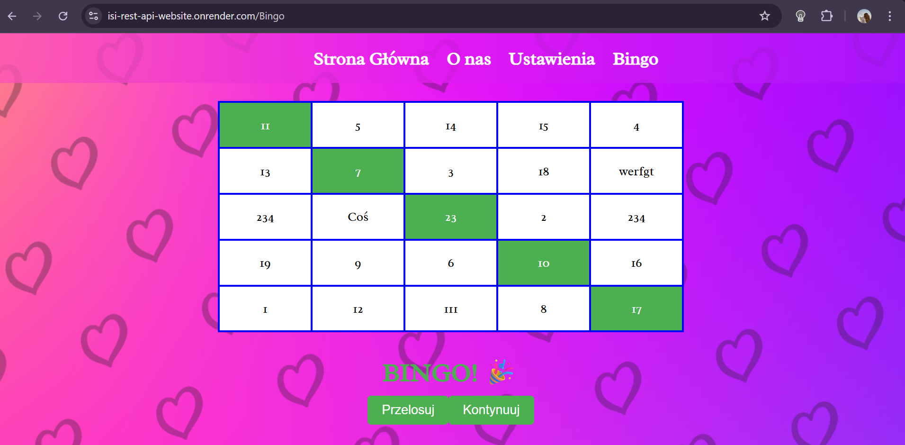

# Link do działającej aplikacji:

[https://isi-aplikacja-blog-1.onrender.com/](https://isi-rest-api-website.onrender.com)

# Zdjęcia do wybranych elementów:
Stawianie bazy danych:

Postawienie serwera:

Postawienie-strony:

Działająca aplikacja:

